# KERT XML Editor

**[English](./README.md)** | **[日本語](./README_ja.md)** | **Deutsch**


## Über dieses Projekt

KERT XML Editor ist eine Desktop-Anwendung, mit der XML-Dateien zur EPUB-Erstellung mit [KERT](https://github.com/quwano/KERT) komfortabel über eine grafische Benutzeroberfläche erstellt und bearbeitet werden können.

Die Anwendung unterstützt das Erstellen und Bearbeiten von XML gemäß dem KERT-XML-Eingabeformat (`document_schema.xsd`) und ist intuitiv bedienbar – auch ohne XML-Kenntnisse.

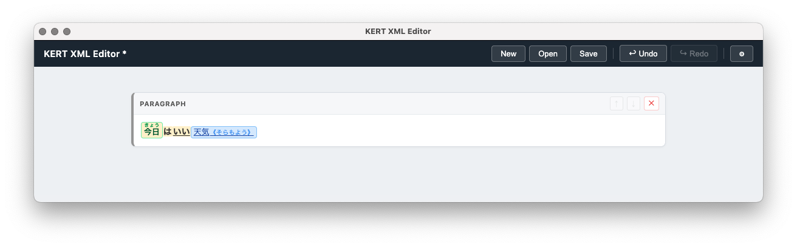

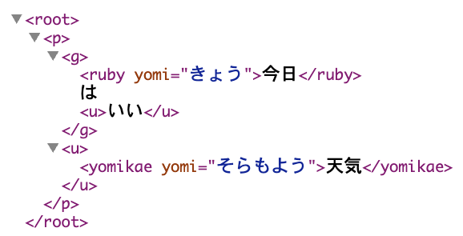

## Getestete Umgebungen

- macOS Sequoia / Tahoe
- Windows 11

## Build-Anleitung

Die Anwendung wird aus dem Quellcode gebaut.

### Voraussetzungen

- [Node.js](https://nodejs.org/) 18 oder höher
- npm

### Schritte

```bash
git clone https://github.com/quwano/KERT_XMLEditor.git
cd KERT_XMLEditor
npm install
```

Build für Mac (`.dmg`):

```bash
npm run build:mac
```

Build für Windows (`.exe`-Installer):

```bash
npm run build:win
```

Die Build-Artefakte werden im Verzeichnis `release/` erstellt.

> **Hinweis zum Windows-Build**  
> Eine Windows-`.exe` kann auch per Cross-Compilation auf einem Mac erzeugt werden.

## Funktionen

### Bearbeitung der Dokumentstruktur

- **Blöcke hinzufügen**: title1–title5 (Überschriften), p (Absätze) und table (Tabellen) an beliebiger Position einfügen

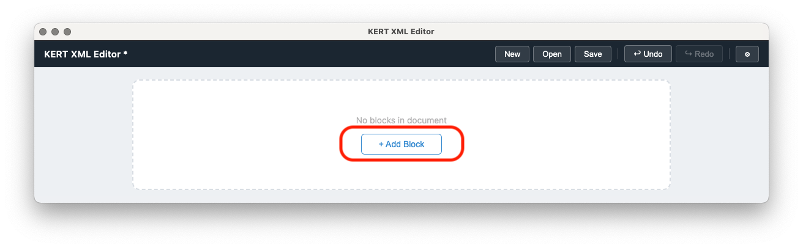

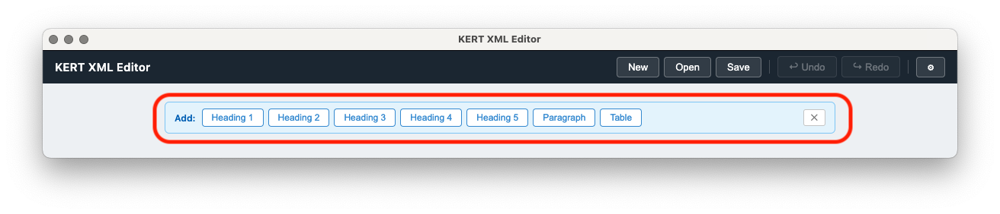

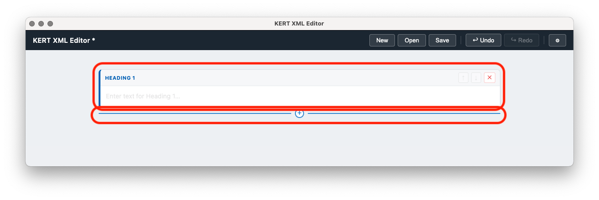

Die horizontale Trennlinie im obigen Bild erscheint beim Darüberfahren mit dem Mauszeiger.

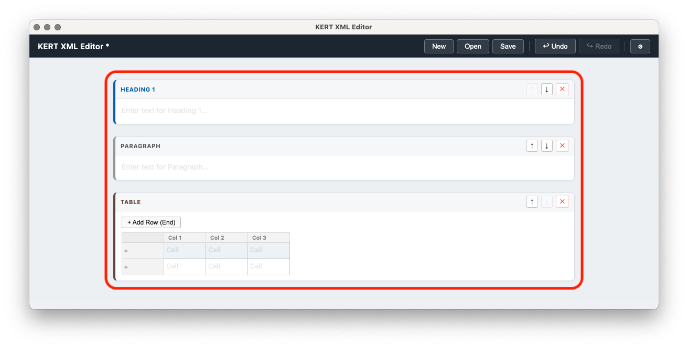

- **Sortieren**: Das ⠿-Handle am linken Rand eines Blocks ziehen zum Neuanordnen, oder die ↑↓-Schaltflächen zum Verschieben verwenden
- **Löschen**: Nicht benötigte Blöcke entfernen

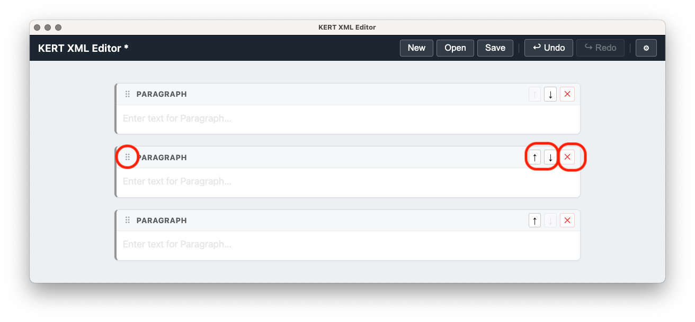

### Rich-Text-Bearbeitung

- Beliebigen Text markieren und per Rechtsklick folgende Auszeichnungen anwenden oder entfernen:
  - **g** (Hervorhebung / Fettschrift)

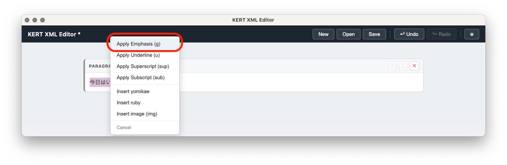

  - **u** (Unterstreichung)

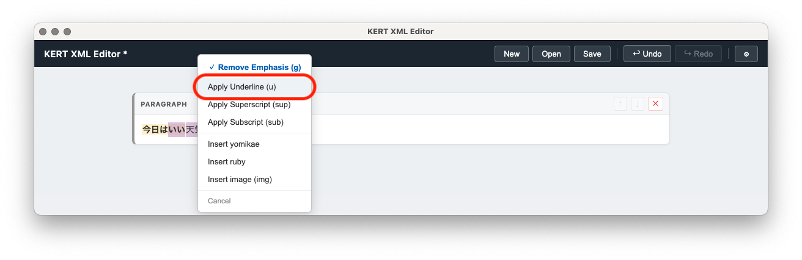

  - **sup** (Hochstellung)
  - **sub** (Tiefstellung)
  - **ruby** (Ruby-Annotation)

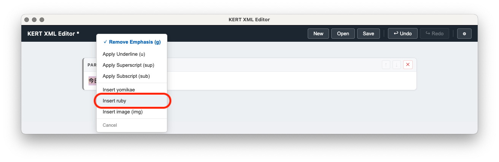

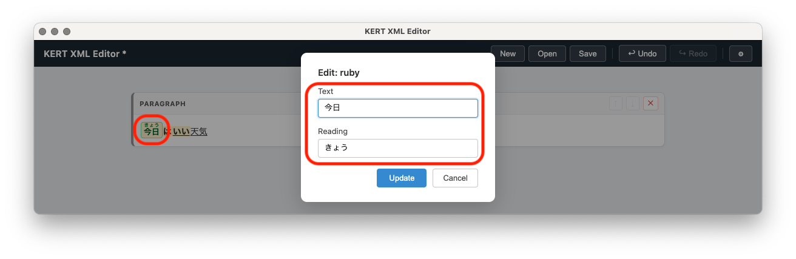

  - **yomikae** (Leseersetzung)

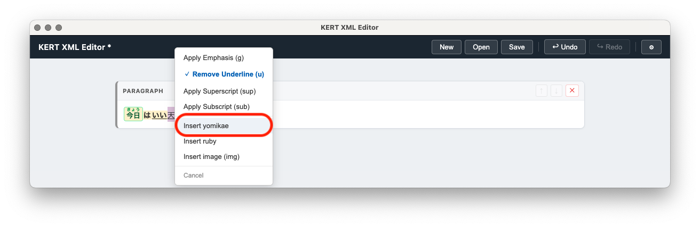

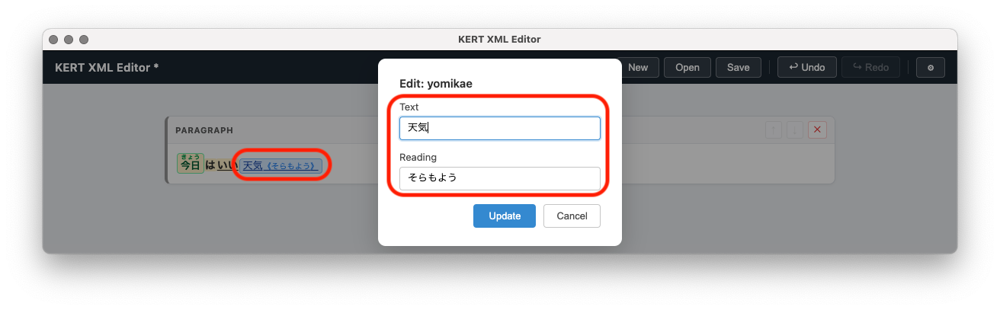

  - **img** (Bild einfügen)

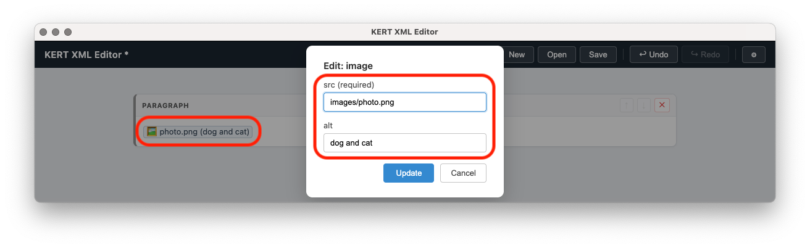

- Bei überlappenden Auszeichnungen wird die XML-Wohlgeformtheit automatisch sichergestellt

### Tabellenbearbeitung

- Zeilen und Spalten hinzufügen, löschen und neu anordnen

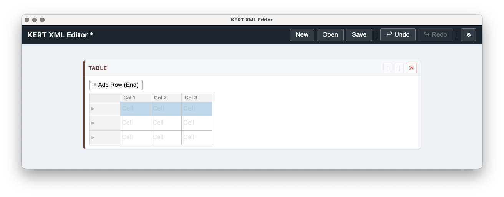

*Ausgangszustand*

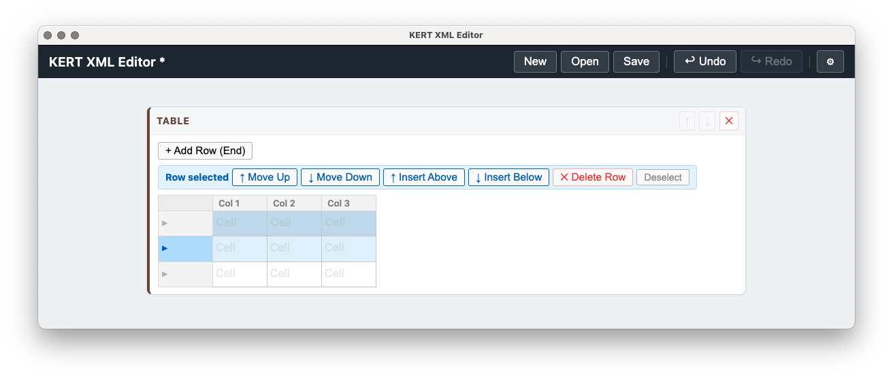

*Zeile ausgewählt*

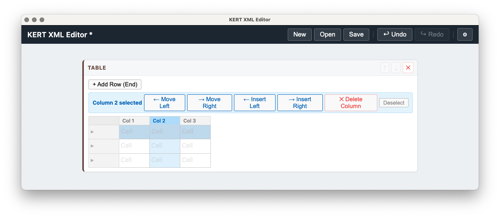

*Spalte ausgewählt*

- Kopfzeilen (th) hinzufügen und entfernen

### Dateioperationen

- XML-Dateien neu erstellen, speichern und öffnen
- XML-Dateien können durch Drag & Drop auf das Anwendungsfenster geöffnet werden
- Beim Öffnen wird eine Validierung gegen `document_schema.xsd` durchgeführt; nicht konforme Dateien werden abgelehnt

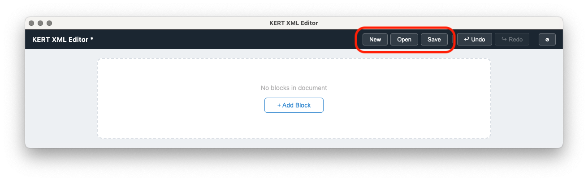

### GUI-Einstellungen

- Anzeigesprache wechseln (日本語 / English / Deutsch)
- Schriftgröße ändern (Small / Normal / Large / XLarge)
- Schriftart ändern (System / Sans-serif / Serif / Monospace)

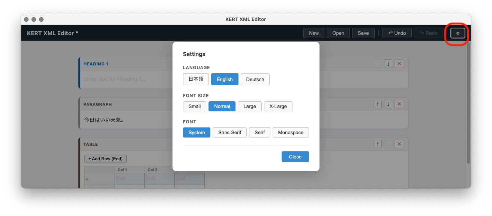

## XML-Schema

Das von dieser Anwendung verarbeitete XML entspricht dem mitgelieferten `document_schema.xsd`.

### Elementübersicht

| Element | Beschreibung |
|---|---|
| `<root>` | Wurzelelement |
| `<title1>`–`<title5>` | Überschriften (Ebene 1–5) |
| `<p>` | Absatz |
| `<table>` / `<tr>` / `<th>` / `<td>` | Tabelle / Zeile / Kopfzelle / Datenzelle |
| `<g>` | Hervorhebung (Fett) |
| `<u>` | Unterstreichung |
| `<sup>` | Hochstellung |
| `<sub>` | Tiefstellung |
| `<ruby yomi="...">` | Ruby-Annotation |
| `<yomikae yomi="...">` | Leseersetzung |
| `` | Bild |

## Autor

KUWANO KAZUYUKI

## Lizenz

Siehe [LICENSE_de.md](LICENSE_de.md).
