# KERT XML/Md Editor

**[English](./README.md)** | **日本語** | **[Deutsch](./README_de.md)**


## このプロジェクトについて

KERT XML/Md Editor は、[KERT](https://github.com/quwano/KERT) で EPUB を生成するための XML ファイル／Markdown ファイルを、GUI により平易に作成・編集できるデスクトップアプリケーションです。

KERT の XML 入力形式（`document_schema.xsd`）に準拠した XML の作成・編集に対応しており、XML の知識がなくても直感的に操作できます。  
あわせて、同じ編集画面で Markdown（KERT Extended CommonMark Notation、`.md` / `.txt`）の作成・編集にも対応しています。

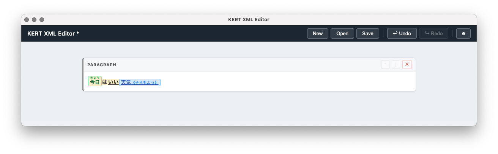

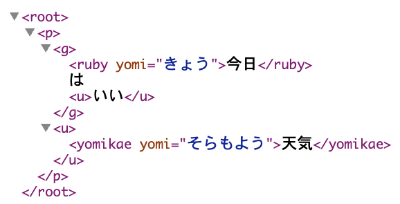

## 動作確認環境

- macOS Sequoia / Tahoe
- Windows 11

## ビルド方法

本アプリはソースコードからビルドして使用します。

### 必要な環境

- [Node.js](https://nodejs.org/) 18 以上
- npm

### 手順

```bash
git clone https://github.com/quwano/KERT_XMLEditor.git
cd KERT_XMLEditor
npm install
```

Mac 向け（`.dmg`）のビルド：

```bash
npm run build:mac
```

Windows 向け（`.exe` インストーラ）のビルド：

```bash
npm run build:win
```

ビルド成果物は `release/` ディレクトリに生成されます。

> **Windows 向けビルドについて**  
> Mac 上でクロスコンパイルにより Windows 向け `.exe` を生成することもできます。

### macOS で「マルウェアです」と表示され、App が開けない／削除される場合

未署名・未公証（Apple Developer ID による Notarization 未取得）の `.app` は、macOS の
バージョンやセキュリティ機能の更新状況によって、初回起動時に「"KERT XML-Md Editor.app" は
開けません。Apple はこの App に悪質なソフトウェアが含まれていないことを確認できません
でした」といった警告が表示され、起動を拒否されたり App がゴミ箱に移動されたりすることが
あります（同じ macOS でもバージョンによって発生の有無が異なります）。

`npm run build:mac` を実行すると、ビルド後に自動的に隔離属性の除去とアドホック署名
（`xattr -cr` および `codesign --deep --force --sign -`）が行われるため、通常はこの Mac
上でビルドした App をそのまま起動できます。ただし、これはローカルでの検証用の緩和策で
あり、`spctl` によるフルアセスメントには通りません。他の Mac に配布・共有すると、転送先
で隔離属性が再付与され、同じ警告が再発することがあります。

それでも警告が表示される場合は、次のいずれかを試してください。

- `.app` を右クリック（または Control + クリック）して「開く」を選択し、表示される
  ダイアログで改めて「開く」を選ぶ
- ターミナルで以下を実行してから再度起動する

  ```bash
  xattr -cr "release/mac-arm64/KERT XML-Md Editor.app"
  codesign --deep --force --sign - "release/mac-arm64/KERT XML-Md Editor.app"
  ```

他の Mac へ恒久的に配布したい場合は、上記のアドホック署名では不十分です。Apple Developer
Program（年間 $99）の Developer ID 証明書を取得し、`APPLE_ID` / `APPLE_APP_SPECIFIC_PASSWORD`
/ `APPLE_TEAM_ID` / `CSC_LINK` / `CSC_KEY_PASSWORD` を環境変数に設定した上でビルドすると、
正式な署名と Notarization が自動的に行われます。

## 操作方法

### ファイル操作
- ドキュメントの新規作成・ファイルの読み込み・上書き・XMLまたはMarkdown（`.md` / `.txt`）での保存ができます。
- 保存は「XML保存」「Md保存」の2つのボタンで、保存形式を明示的に選択します。
- 一度保存または読み込んだファイルには「上書き保存」ボタンで確認ダイアログを経て直接書き戻せます。保存先が未確定の新規文書ではボタンは無効化されます。
- ファイルをウィンドウにドラッグ＆ドロップして開くことができます。ドラッグ＆ドロップで開いたファイルも上書き保存の対象になります。
- XMLの読み込み時には `document_schema.xsd` に基づく妥当性検証を実施。スキーマに準拠しないファイルは読み込みを拒否します
- 新規作成・ファイルを開く・アプリを閉じる際、未保存の変更があれば確認ダイアログが表示されます。

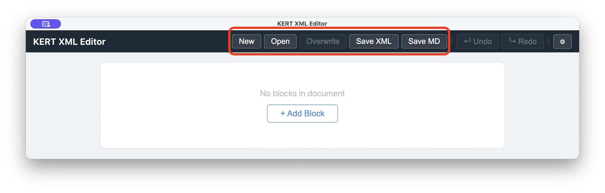

- 直前の操作の取り消しとやり直しができます（Undo: `Cmd/Ctrl + Z`、Redo: `Cmd/Ctrl + Shift + Z` または `Ctrl + Y`）。

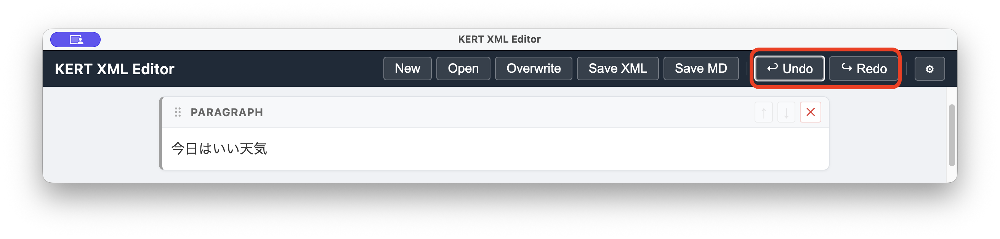

### GUI 設定

- 表示言語の切り替え（日本語・English・Deutsch）
- フォントサイズの変更（小 / 標準 / 大 / 特大 / カスタム）
- 書体の変更

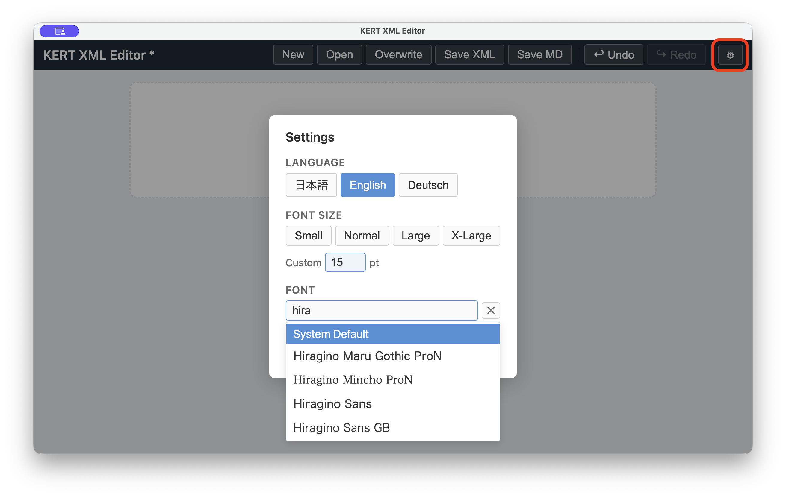

### ドキュメント構造の編集

- **ブロックの追加**: title1〜title5（見出し）、p（段落）、table（表）、ブロック数式を任意の位置に追加

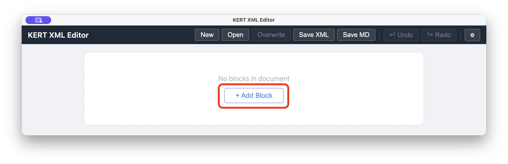

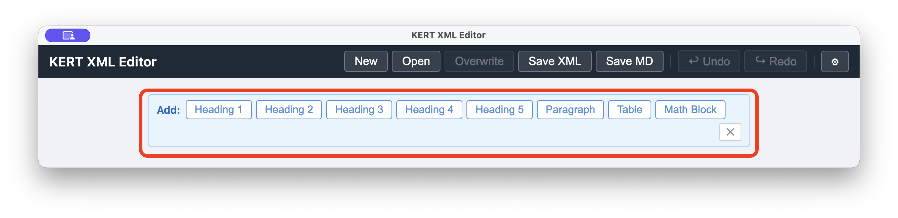

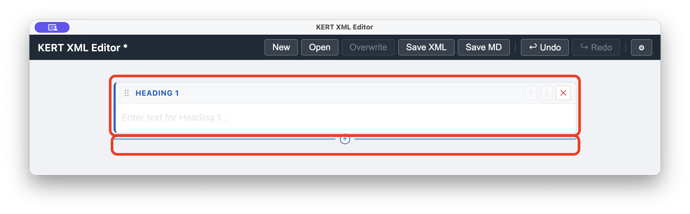

*水平線はポインタを近づけると表示されます。*

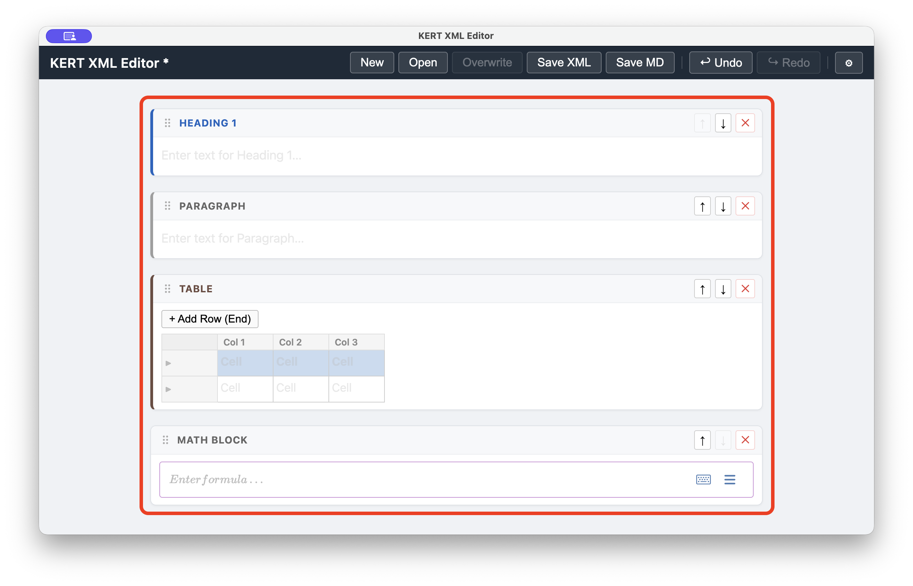

- **見出しレベルの変更**: title1〜title5 のブロックは、追加後もラベル部分のドロップダウンからレベルを変更できます
  
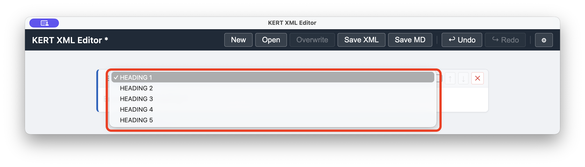

- **並び替え**: ブロック左端の ⠿ ハンドルをドラッグして並び替え、または ↑↓ ボタンで上下に移動
- **削除**: 不要なブロックを削除

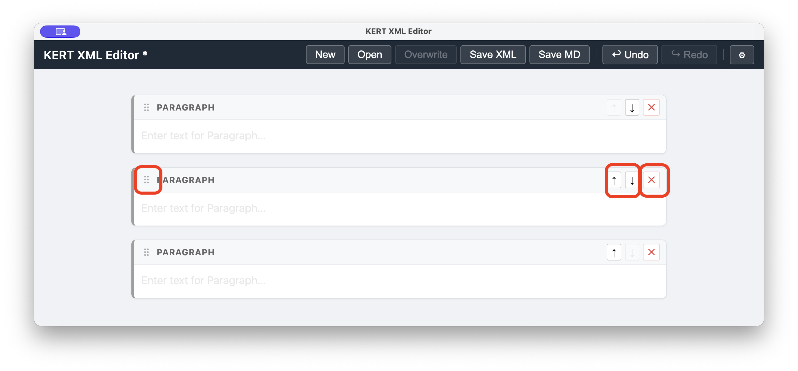

### リッチテキストの編集

- テキストの任意の範囲を選択して右クリックすることで、以下のマークアップを適用・解除できます：
  - **g**（強調・太字）

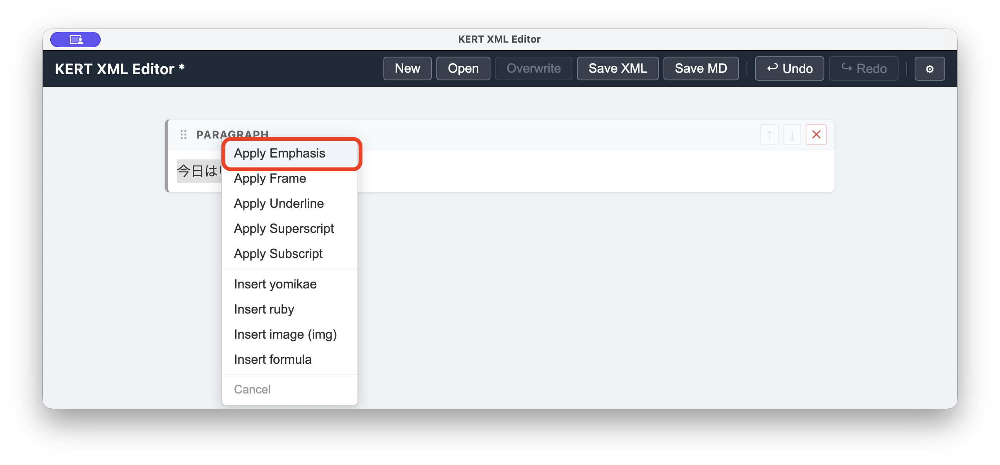

  - **u**（下線）

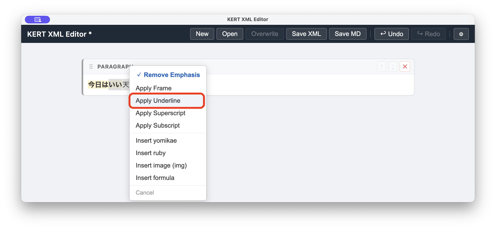

  - **frame**（フレーム囲み）
  - **sup**（上付き文字）
  - **sub**（下付き文字）
  - **ruby**（ルビ）

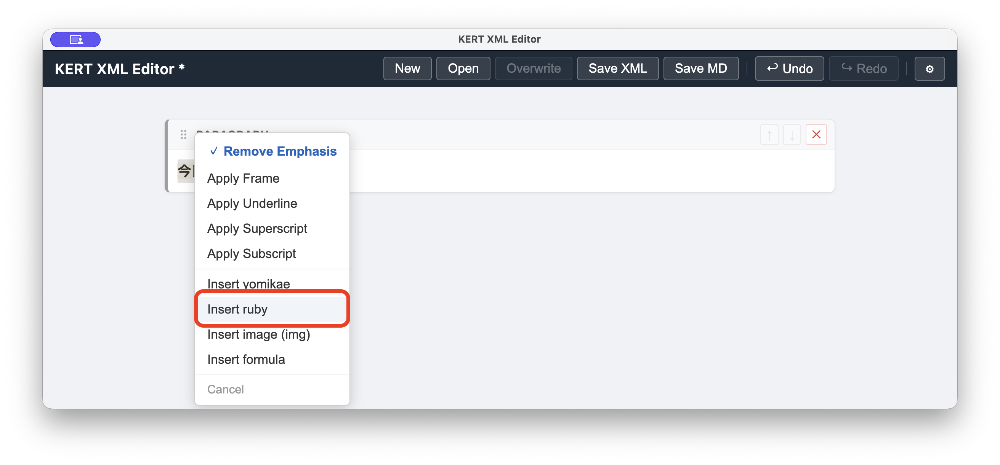

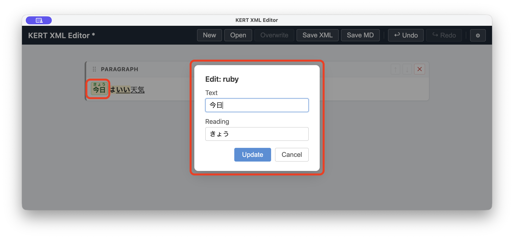

  - **yomikae**（読み替え）

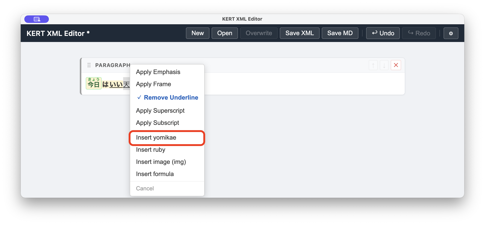

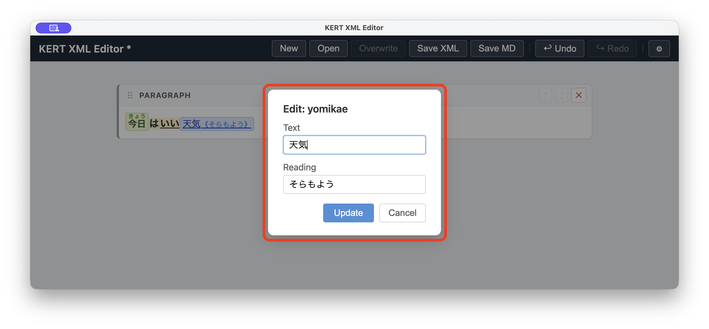

  - **img**（画像の挿入）  
    - 画像を挿入する際は「参照...」ボタンからファイル選択ダイアログで画像ファイルを選べます。保存時、画像のパスは保存先ディレクトリからの相対パスに自動変換されます（XML・Markdown共通）


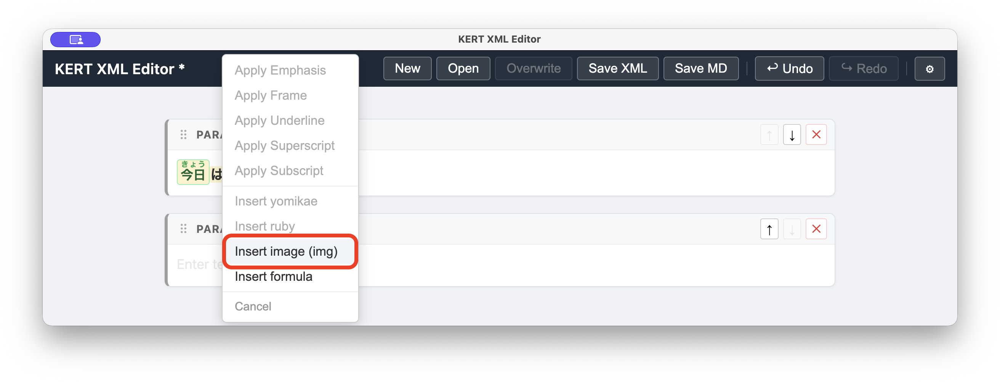

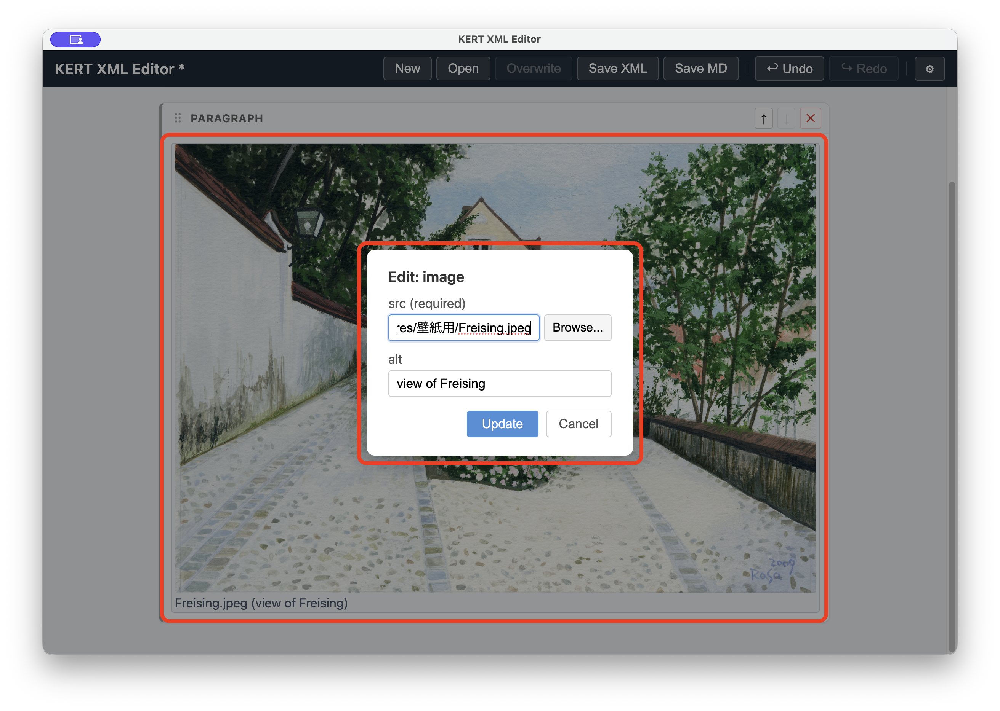


- マークアップが重なる場合も、XMLの整形式が自動的に保たれます。

### 数式の編集

- [MathLive](https://cortexjs.io/mathlive/) による数式入力に対応しています。
- 文中に挿入する「インライン数式」と、独立したブロックとしての「ブロック数式」の2種類を扱えます。  
    - インライン数式
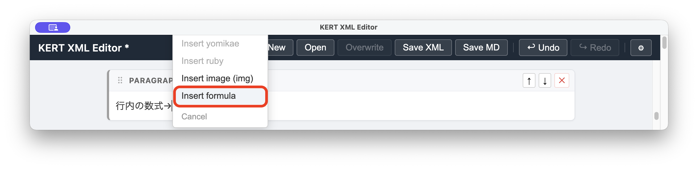
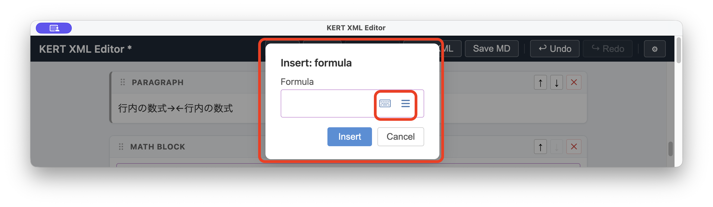
    - ブロック数式
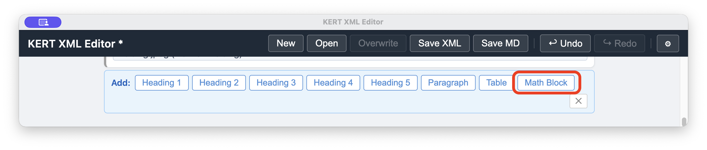
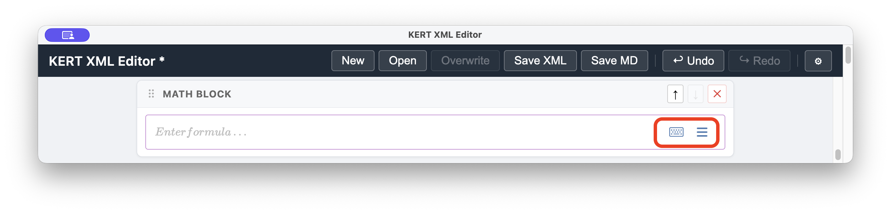
    - インライン・ブロック共通入力ダイアログ
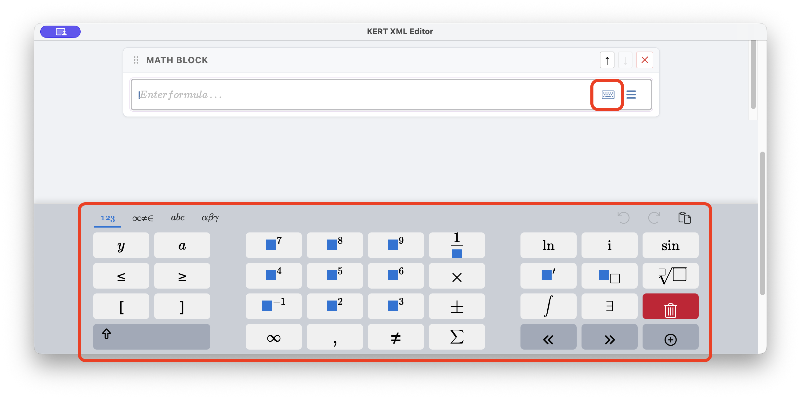
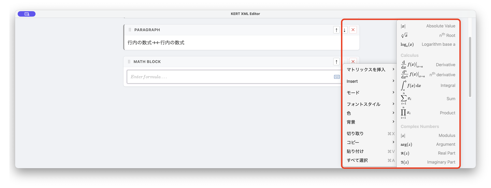

- XML として保存する場合は MathML 3.0（`<math>` 要素）として、Markdown として保存する場合は LaTeX ソース（`$...$`）として書き出されます。

### 表の編集

- 行・列の追加・削除・並び替え
    - 初期状態
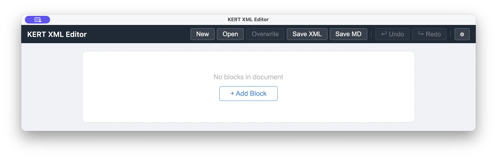
    - 行選択状態
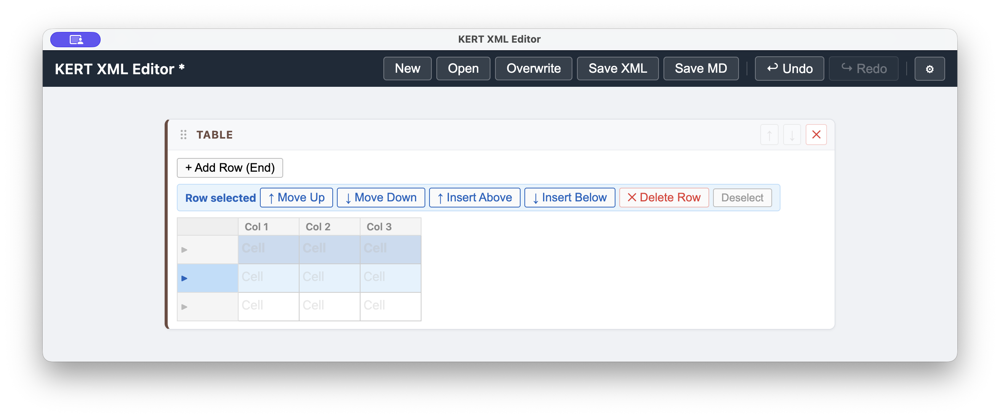
    - 列選択状態
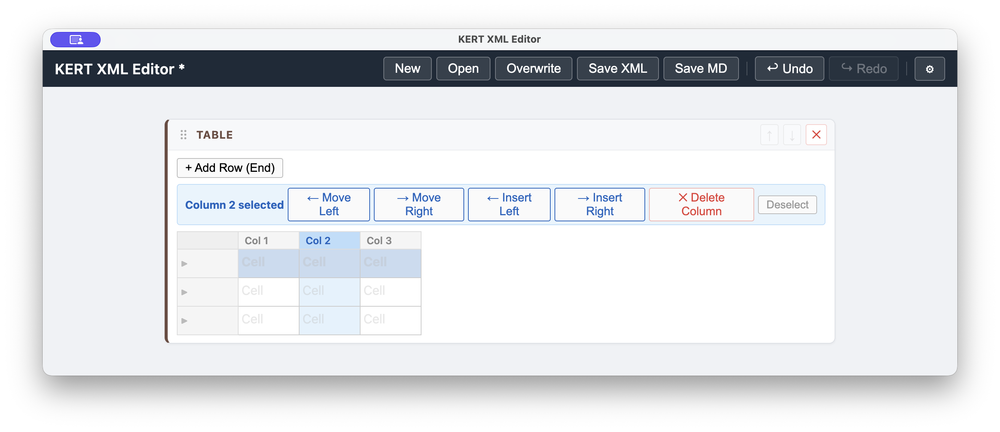
- ヘッダー行（th）の追加・削除

## コンテンツと XML・Markdown の対応表

本アプリが扱う XML は、同梱の `document_schema.xsd` に準拠しています。  
また、Markdown 保存形式は独自拡張を含む CommonMark 方言（KERT Extended CommonMark Notation）です。  
エディタ上で追加できる各ブロックコンテンツ・インラインコンテンツについて、XML保存時のタグとMarkdown保存時の記法の対応は以下の通りです。

### ブロックコンテンツ

| ブロック                | XML タグ                                 | Markdown 記法               |
|---------------------|-----------------------------------------|----------------------------|
| 見出し（レベル 1〜5）        | `<title1>`〜`<title5>`                   | `#`〜`#####` + 半角スペース + テキスト |
| 段落                  | `<p>`                                   | 通常のテキスト行                    |
| 表                   | `<table>` / `<tr>` / `<th>` / `<td>`    | GFM テーブル（`\| ... \| ... \|`） |
| ブロック数式              | `<math>...</math>`（MathML 3.0）           | `$$` の行 … 数式 … `$$` の行     |

### インラインコンテンツ

| コンテンツ    | XML タグ                              | Markdown 記法             |
|---------|--------------------------------------|--------------------------|
| 強調（太字）   | `<g>テキスト</g>`                        | `**テキスト**`               |
| 下線      | `<u>テキスト</u>`                        | `[テキスト]{.underline}`     |
| フレーム（囲み枠） | `<frame>テキスト</frame>`               | `[テキスト]{.frame}`         |
| 上付き文字   | `<sup>テキスト</sup>`                    | `^テキスト^`                 |
| 下付き文字   | `<sub>テキスト</sub>`                    | `~テキスト~`                 |
| ルビ      | `<ruby yomi="よみ">テキスト</ruby>`        | `[テキスト](-よみ)`            |
| 読み替え    | `<yomikae yomi="よみ">テキスト</yomikae>`  | `[テキスト](+よみ)`            |
| 画像      | ``        | ``          |
| インライン数式 | `<math>...</math>`（MathML 3.0、インライン）  | `$数式$`                   |

> **MathMLスキーマについて**  
> 数式（`<math>` 要素、`http://www.w3.org/1998/Math/MathML` 名前空間）は、`document_schema.xsd` が同梱の `mathml3/`（W3C MathML 3.0 XML Schema）を `xs:import` で参照し、要素として定義しています。なお、読み込み時の妥当性検証では `<math>` 要素の内部構造までは検証対象外です（数式の入力・編集は MathLive が担います）。

> **数式のMathML保存について**  
> Markdown保存では数式はLaTeXソース（`$...$` / `$$...$$`）のみが保持され、MathLiveが生成したMathMLそのものは保存されません。Markdownファイルを再度開いて数式を編集すると、MathLiveがLaTeXソースからMathMLを再生成します。

> **エスケープについて**  
> Markdown中で `\` `*` `[` `$` `^` `~` を記法ではなく文字として使いたい場合は、`\` を前置してエスケープします（例: `\*` → `*`）。

## 作者

KUWANO KAZUYUKI

## ライセンス・権利情報

[LICENSE.md](LICENSE.md) / [LICENSE_ja.md](LICENSE_ja.md) を参照してください。
